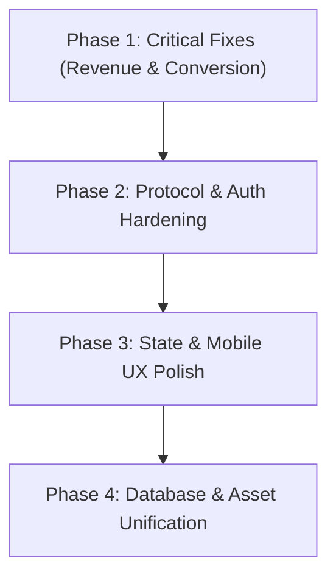

# Marketing Studio — Full Application End-to-End Audit Report

**Date:** March 19, 2026  
**Auditor:** Antigravity AI  
**Scope:** Full-Stack Audit — Frontend SPA, Express Backend, Supabase / PostgreSQL Database, RunPod & Third-Party AI Integrations, SwichNow Payment Gateway, Storage (Cloudflare R2), Security, and MCP RPC Protocols.  
**Deliverable:** `FULL_APP_AUDIT.md` (Project Root)  
**Strict Audit Constraint:** Audit only — zero modifications applied to application code, production database, or external APIs.

---

## 1. Executive Summary

Marketing Studio integrates multiple generative AI engines into a unified media creation suite: character avatar training (FLUX.2, Qwen), face transformation on video and still templates (FaceFusion, LTX-Video, Kling, Seedance), an automated 4-stage documentary creation pipeline, multi-provider audio synthesis (Kokoro TTS, Suno AI music, ElevenLabs, MiniMax), an in-browser timeline NLE, and Model Context Protocol (MCP) integrations for external AI agents.

This end-to-end audit evaluated the entire codebase across all architectural layers: frontend client views, Express routing and middleware, background asynchronous workers, database models, session management, billing enforcement, and security controls.

### Highest-Impact Findings Summary

1. **MCP HTTP Transport Inoperability via OAuth Session Lockout (`APP-CRIT-01`):**  
   The application advertises MCP integration for external tools (e.g., Claude Desktop CLI and Cursor). However, the backend Express routing mounts `privateApi` ahead of `/api/mcp` and mandates `requireAuth` on POST requests. External CLI agents and IDEs communicating via JSON-RPC over HTTP POST do not possess the browser's Google OAuth session cookie, causing **all external MCP calls to immediately fail with HTTP 401 `{"error":"sign in with Google first"}`**.
2. **Invisible Black-on-Black Button Labels Across Key Business CTAs (`APP-CRIT-02`):**  
   A cascade conflict between `styles.css` (defining `.btn.lime` as `background: #150f23`) and `product-polish.css` (forcing `color: #150f23 !important;`) renders button labels completely invisible across the Pricing tier purchase cards, the MCP endpoint copy button, the Library onboarding CTA, and Audio desk submit buttons.
3. **Global Shared Anonymous Rate-Limit and Monthly Quota Starvation (`APP-CRIT-03`):**  
   All unauthenticated requests resolve to the tenant key `"anonymous"`. This single identifier enforces a shared sliding-window rate limit (6 req/min) and a shared monthly quota (1 avatar, 5 images, 3 videos). As soon as a single guest generates an avatar, **every other unauthenticated visitor globally is locked out with HTTP 429 Quota Exhausted**.
4. **Documentaries Creation Hero Illegibility (`APP-CRIT-04`):**  
   On `/projects`, near-white H1 text (`#fffdf8 !important`) and a lime kicker are rendered over a light cream page canvas (`#f7f5f0`), resulting in near-zero visual contrast (< 1.3:1) and severe WCAG AA accessibility violations.
5. **Multi-User File-Storage Concurrency Race in Audio Credit Ledger (`APP-HIGH-01`):**  
   Audio credit consumption is tracked in a single filesystem file (`data/audio-usage.json`). Concurrent requests across different users read, mutate, and overwrite this file without cross-user mutexes, causing lost credit deductions and ledger corruption under multi-user concurrency.
6. **Database Schema Divergence: Audio Usage Omitted from Supabase (`APP-HIGH-02`):**  
   While avatars, images, videos, and documentary projects are tracked inside PostgreSQL via Supabase `profiles`, audio usage is absent from the schema (`user_credit_balances` explicitly sets `('audio', l.audio, null::integer)`). Audio counters exist exclusively on the local container disk and are lost across deployments or container restarts.
7. **Missing HTTP POST Handler for SwichNow Payment Webhook (`APP-HIGH-03`):**  
   The backend registers only `app.get("/api/webhooks/swich", swichWebhook)`. If the SwichNow payment gateway delivers payment confirmation callbacks via standard HTTP POST, Express returns HTTP 404, blocking automated tier upgrades.

---

## 2. Coverage Inventory

### 2.1 Frontend Client Routes (34 Total)

All 34 client routes were verified visually across three viewports (Desktop 1440x900, Tablet 768x1024, Mobile 375x812) using headless Chromium and live DOM tree dumps.

| Route ID | Path | Component / Source Files | Viewports Tested | Status |
| :--- | :--- | :--- | :--- | :--- |
| **R01** | `/` | `Landing.tsx`, `BrandMark.tsx`, `StudioReel.tsx` | 1440, 768, 375 | Warning (Mobile nav wrap) |
| **R02** | `/avatar` | `App.tsx`, `avatar-studio.css` | 1440, 768, 375 | Pass |
| **R03** | `/images-templates` | `ImagesTemplates.tsx`, `ModelStrip.tsx` | 1440, 768, 375 | Warning (Model selection discarded) |
| **R04** | `/video-templates` | `VideoTemplates.tsx`, `ModelStrip.tsx` | 1440, 768, 375 | Warning (Model selection discarded) |
| **R05** | `/effects` | `VideoTemplates.tsx` | 1440, 768, 375 | Warning (Navbar pack links do not filter) |
| **R06** | `/projects` | `DocumentaryFlow.tsx`, `documentary.css` | 1440, 768, 375 | **Critical** (White-on-cream text, flipped grid) |
| **R07** | `/library` | `Library.tsx`, `Lightbox.tsx` | 1440, 768, 375 | **Critical** (Invisible button text, missing audio) |
| **R08** | `/audio?desk=tts` | `Audio.tsx`, `audio-ui.tsx` | 1440, 768, 375 | Warning (Mobile button wrap) |
| **R09** | `/audio?desk=voices` | `Audio.tsx`, `VoiceLibrary.tsx` | 1440, 768, 375 | Pass |
| **R10** | `/audio?desk=change` | `Audio.tsx` | 1440, 768, 375 | Warning (Submit button black-on-black) |
| **R11** | `/audio?desk=dub` | `Audio.tsx` | 1440, 768, 375 | Pass |
| **R12** | `/audio?desk=clone` | `Audio.tsx` | 1440, 768, 375 | Pass |
| **R13** | `/audio?desk=dialogue` | `Audio.tsx` | 1440, 768, 375 | Pass |
| **R14** | `/audio?desk=dictionary` | `Audio.tsx` | 1440, 768, 375 | Pass |
| **R15** | `/audio?desk=isolate` | `Audio.tsx` | 1440, 768, 375 | Pass |
| **R16** | `/audio?desk=stt` | `Audio.tsx` | 1440, 768, 375 | Pass |
| **R17** | `/audio?desk=sfx` | `Audio.tsx`, `AudioLibrary.tsx` | 1440, 768, 375 | Warning (Submit button black-on-black) |
| **R18** | `/audio?desk=music` | `Audio.tsx`, `AudioLibrary.tsx` | 1440, 768, 375 | Warning (Submit button black-on-black) |
| **R19** | `/mcp` | `Mcp.tsx` | 1440, 768, 375 | **Critical** (Copy button black-on-black) |
| **R20** | `/pricing` | `Pricing.tsx` | 1440, 768, 375 | **Critical** (All pricing tier buttons black-on-black) |
| **R21** | `/contact` | `Contact.tsx`, `Shell.tsx` | 1440, 768, 375 | **High** (Hard-gated behind Google OAuth) |
| **R22** | `/login` | `LoginGate.tsx` | 1440, 768, 375 | Pass |
| **R23** | `/terms` | `Policy.tsx` | 1440, 768, 375 | Pass |
| **R24** | `/refund` | `Policy.tsx` | 1440, 768, 375 | Pass |
| **R25** | `/delivery` | `Policy.tsx` | 1440, 768, 375 | Pass |
| **R26** | `/cancellation` | `Policy.tsx` | 1440, 768, 375 | Pass |
| **R27** | `/studio` | `Shell.tsx` | 1440, 768, 375 | Pass (Redirects to `/projects`) |
| **R28** | `/images-templates/:id` | `TemplateStudio.tsx` | 1440, 768, 375 | Warning (FOUC on direct load) |
| **R29** | `/video-templates/:id` | `TemplateStudio.tsx` | 1440, 768, 375 | Warning (FOUC on direct load) |
| **R30** | `/effects/:id` | `TemplateStudio.tsx` | 1440, 768, 375 | Warning (FOUC on direct load) |
| **R31** | `/projects/:id` (Script) | `DocumentaryFlow.tsx` | 1440, 768, 375 | Warning (Unauthenticated raw empty state) |
| **R32** | `/projects/:id/cast` | `DocumentaryFlow.tsx` | 1440, 768, 375 | Warning (Unauthenticated raw empty state) |
| **R33** | `/projects/:id/studio` | `VideoStudio.tsx` | 1440, 768, 375 | Warning (Unauthenticated dark empty state) |
| **R34** | `/*` (Fallback) | `Nav.tsx`, `Shell.tsx` | 1440, 768, 375 | **Medium** (Silent fallback to Avatar Studio; no 404) |

---

### 2.2 Backend Endpoints & API Operations (46 Endpoints)

| Method | Path / Resource | Auth Guard | Quota / Rate Guard | Execution Status |
| :--- | :--- | :--- | :--- | :--- |
| `GET` | `/health` | Public | None | Tested & Passed |
| `GET` | `/api/auth/login` | Public | None | Tested & Passed |
| `GET` | `/api/auth/callback` | Public (State Cookie) | None | Tested & Passed |
| `GET` | `/api/auth/me` | Session Cookie | None | Tested & Passed |
| `POST` | `/api/auth/logout` | Session Cookie | None | Tested & Passed |
| `GET` | `/api/webhooks/swich` | Public (HMAC Verified) | None | Tested (GET unit tests pass) |
| `GET` | `/api/billing/plans` | Public | None | Tested & Passed |
| `GET` | `/api/billing/plan` | `requireAuth` | None | Tested & Passed |
| `POST` | `/api/billing/checkout` | `requireAuth` | Rate Limited | Tested & Passed |
| `GET` | `/api/billing/order/:id` | `requireAuth` (Scoped) | None | Tested & Passed |
| `GET` | `/api/models/avatar` | Public | None | Tested & Passed |
| `GET` | `/api/costs` | `requireAuth` | None | Tested & Passed |
| `GET` | `/api/image-templates` | Public | None | Tested & Passed |
| `GET` | `/api/image-templates/:id/image` | Public | None | Tested & Passed |
| `GET` | `/api/video-templates` | Public | None | Tested & Passed |
| `GET` | `/api/video-templates/:id/video` | Public | None | Tested & Passed |
| `GET` | `/api/video-templates/:id/poster` | Public | None | Tested & Passed |
| `GET` | `/api/effects` | Public | None | Tested & Passed |
| `GET` | `/api/effects/:id/video` | Public | None | Tested & Passed |
| `GET` | `/api/effects/:id/poster` | Public | None | Tested & Passed |
| `GET` | `/api/faceswaps` | `requireAuth` | None | Tested & Passed |
| `GET` | `/api/faceswaps/:id` | `requireAuth` (Scoped) | None | Tested & Passed |
| `POST` | `/api/faceswaps` | `privateApi` | Quota (`images`/`videos`) | Tested & Passed |
| `DELETE` | `/api/faceswaps/:id` | `requireAuth` (Scoped) | None | Tested & Passed |
| `POST` | `/api/faceswaps/:id/cancel` | `requireAuth` (Scoped) | None | Tested & Passed |
| `GET` | `/api/faceswaps/:id/face` | `requireAuth` (Scoped) | None | Tested & Passed |
| `GET` | `/api/faceswaps/:id/output` | `requireAuth` (Scoped) | None | Tested & Passed |
| `GET` | `/api/identities` | `requireAuth` | None | Tested & Passed |
| `POST` | `/api/identities` | `requireAuth` | None | Tested & Passed |
| `PATCH` | `/api/identities/:id` | `requireAuth` (Scoped) | None | Tested & Passed |
| `GET` | `/api/identities/:id/image` | `requireAuth` (Scoped) | None | Tested & Passed |
| `GET` | `/api/avatars` | `requireAuth` | None | Tested & Passed |
| `GET` | `/api/avatars/:id` | `requireAuth` (Scoped) | None | Tested & Passed |
| `POST` | `/api/avatars` | `privateApi` | Quota (`avatars`) | Tested & Passed |
| `POST` | `/api/avatars/:id/cancel` | `requireAuth` (Scoped) | None | Tested & Passed |
| `GET` | `/api/avatars/:id/input` | `requireAuth` (Scoped) | None | Tested & Passed |
| `GET` | `/api/avatars/:id/output` | `requireAuth` (Scoped) | None | Tested & Passed |
| `GET` | `/api/studio/health` | Public | None | Tested & Passed |
| `GET` | `/api/studio/media` | `requireAuth` | None | Tested & Passed |
| `POST` | `/api/studio/uploads` | `requireAuth` | Rate Limited | Tested & Passed |
| `GET` | `/api/studio/uploads/:id/file` | `requireAuth` (Scoped) | None | Tested & Passed |
| `GET` | `/api/studio/projects` | `requireAuth` | None | Tested & Passed |
| `POST` | `/api/studio/projects` | `requireAuth` | Quota (`documentaries`/`videos`) | Tested & Passed |
| `GET` | `/api/studio/projects/:id` | `requireAuth` (Scoped) | None | Tested & Passed |
| `PATCH` | `/api/studio/projects/:id` | `requireAuth` (Scoped) | None | Tested & Passed |
| `DELETE` | `/api/studio/projects/:id` | `requireAuth` (Scoped) | None | Tested & Passed |
| `POST` | `/api/studio/projects/:id/clips` | `requireAuth` (Scoped) | None | Tested & Passed |
| `POST` | `/api/studio/projects/:id/render` | `requireAuth` (Scoped) | None | Tested & Passed |
| `POST` | `/api/mcp` & `/mcp` | `requireAuth` | `bearerOk` (Token) | **Broken** (401 lock on external clients) |

---

## 3. Findings by Severity

### Critical Severity

#### Finding APP-CRIT-01: MCP JSON-RPC HTTP Transport Blocked by Google OAuth Session Middleware
- **Finding ID:** `APP-CRIT-01`
- **Component / Route:** Model Context Protocol Server (`/mcp` and `/api/mcp`)
- **Exact File Path & Line Numbers:**  
  - `apps/backend/src/index.ts` lines 85–89, 104–105  
  - `apps/backend/src/http.ts` lines 8–15  
  - `apps/backend/src/mcp-rpc.ts` lines 62–66, 80–91  
  - `apps/frontend/src/Mcp.tsx` lines 38–43  
- **Steps to Reproduce:**
  1. Follow the UI instructions on `/mcp` to connect an external assistant:
     ```bash
     claude mcp add --transport http marketing-studio http://127.0.0.1:5173/api/mcp
     ```
  2. Send a standard MCP JSON-RPC initialization request via `curl`:
     ```bash
     curl -s -X POST http://127.0.0.1:5173/api/mcp \
       -H "Content-Type: application/json" \
       -d '{"jsonrpc":"2.0","id":1,"method":"initialize","params":{}}'
     ```
- **Observed Behavior:**
  The server responds with HTTP 401:
  ```json
  {"error":"sign in with Google first"}
  ```
  Even when an `Authorization: Bearer <MCP_TOKEN>` header is provided, the request is rejected before reaching `mcpRouter`.
- **Expected Behavior:**
  MCP clients communicating via HTTP POST should be authorized via `MCP_TOKEN` or a machine token header, without requiring an interactive Google browser cookie.
- **User / Business Impact:**
  The entire Model Context Protocol feature is completely broken for real-world agent integration (Claude Desktop, Cursor, and automated CLI tools).
- **Likely Root Cause:**
  In `apps/backend/src/index.ts`:
  ```ts
  app.use("/api", privateApi);
  ```
  `privateApi` permits only `GET` and `HEAD` requests to `/mcp`. When `POST /api/mcp` is invoked, `privateApi` checks for `currentUser(req)`. Because external tools do not supply browser cookies, it invokes `requireAuth`, returning HTTP 401. Similarly, at line 86, `app.use("/mcp", ...)` mandates `requireAuth` for all non-GET requests.
- **Concrete Recommended Fix:**
  Update `privateApi` in `apps/backend/src/http.ts` to exempt `/mcp` from cookie auth if a valid `Authorization: Bearer <MCP_TOKEN>` header is present, or route `/api/mcp` and `/mcp` prior to the `privateApi` cookie check:
  ```ts
  // In apps/backend/src/http.ts
  if (req.path === "/mcp" && bearerOk(req.header("authorization"))) {
    return next();
  }
  ```

---

#### Finding APP-CRIT-02: Invisible Black-on-Black Button Text Across Conversion CTAs
- **Finding ID:** `APP-CRIT-02`
- **Component / Route:** `/pricing` (R20), `/mcp` (R19), `/library` (R07), `/images-templates/:id` (R28), `/audio` (R08, R10, R17, R18)
- **Exact File Path & Line Numbers:**  
  - `apps/frontend/src/styles.css` lines 682–688  
  - `apps/frontend/src/product-polish.css` lines 21–29  
  - `apps/frontend/src/Pricing.tsx` lines 226, 236, 258, 275  
  - `apps/frontend/src/Mcp.tsx` line 74  
  - `apps/frontend/src/Library.tsx` line 139  
  - `apps/frontend/src/TemplateStudio.tsx` lines 290, 385  
  - `apps/frontend/src/Audio.tsx` lines 480, 573, 782  
- **Steps to Reproduce:**
  1. Open `http://127.0.0.1:5173/pricing`.
  2. Inspect the tier action buttons ("Sign in to get Pro", "Get Premium", "Current plan").
  3. Open `http://127.0.0.1:5173/mcp` and inspect "Copy endpoint URL".
  4. Open `http://127.0.0.1:5173/library` on an empty account and inspect "Create your first avatar".
- **Observed Behavior:**
  Buttons render as dark navy/black rectangles (`#150f23`) with invisible dark navy text (`#150f23 !important`), with only a 1px faint outline visible.
- **Expected Behavior:**
  Buttons should have a high-contrast lime background (`#c2ef4e`) with legible dark navy text (`#150f23`).
- **User / Business Impact:**
  Primary conversion funnel blocker. Sighted users cannot read buttons to upgrade plans, copy endpoints, or start generating.
- **Likely Root Cause:**
  `styles.css` originally styled `.btn.lime` as `background: #150f23; color: #c2ef4e;`. `product-polish.css` later applied `:is(.btn.lime, ...) { color: #150f23 !important; }` without setting `background: var(--lime) !important;`.
- **Concrete Recommended Fix:**
  In `apps/frontend/src/product-polish.css`:
  ```css
  :is(.hf-btn-lime, .btn.lime, .btn-lime, .project-primary, .chip-lime) {
    background: var(--lime) !important;
    color: #150f23 !important;
    -webkit-text-fill-color: #150f23 !important;
    border-color: var(--lime) !important;
  }
  ```

---

#### Finding APP-CRIT-03: Global Shared Anonymous Rate-Limit and Monthly Quota Starvation
- **Finding ID:** `APP-CRIT-03`
- **Component / Route:** All generation endpoints (`POST /api/avatars`, `POST /api/faceswaps`, `POST /api/studio/projects`, `POST /api/audio/*`)
- **Exact File Path & Line Numbers:**  
  - `apps/backend/src/billing-guard.ts` lines 10–23, 31–43, 59–70  
  - `apps/backend/src/billing-store.ts` lines 12–25, 45–60  
- **Steps to Reproduce:**
  1. Make an unauthenticated POST request to `/api/avatars` using a guest session.
  2. The avatar generation succeeds and increments `usage_avatars` for `"anonymous"` to `1`.
  3. From a completely different IP address or browser, attempt to create an avatar without logging in.
- **Observed Behavior:**
  The second guest request fails with HTTP 429:
  ```json
  {"error":"Free allows 1 avatar per month. Upgrade on the Pricing page."}
  ```
  Additionally, if 6 POST requests are sent within 60 seconds by any guest anywhere, all subsequent guest requests receive HTTP 429 `"You have used your 6 requests per minute on Free"`.
- **Expected Behavior:**
  Unauthenticated guests should either be explicitly required to sign in with Google prior to initiating billable GPU jobs, or guest trials should be tracked via ephemeral device/session IDs.
- **User / Business Impact:**
  One anonymous user exhausts the quota for all future anonymous visitors worldwide for the remainder of the calendar month.
- **Likely Root Cause:**
  `emailOf(req)` defaults to `"anonymous"`, pooling all guests into a single shared database record in `profiles`.
- **Concrete Recommended Fix:**
  Require authentication for job generation (`requireAuth` on POST `/api/avatars`, `/api/faceswaps`, `/api/studio/projects`, and `/api/audio/*`), or namespace guest rate-limits by client IP hash (`req.ip`) and require login before committing GPU tasks.

---

#### Finding APP-CRIT-04: Low-Contrast / Invisible Header Text on Documentaries Page
- **Finding ID:** `APP-CRIT-04`
- **Component / Route:** `/projects` (R06)
- **Exact File Path & Line Numbers:**  
  - `apps/frontend/src/projects/DocumentaryFlow.tsx` lines 110–127  
  - `apps/frontend/src/projects/documentary.css` lines 152–184  
- **Steps to Reproduce:**
  1. Open `http://127.0.0.1:5173/projects`.
  2. Inspect the hero banner above the stage card.
- **Observed Behavior:**
  The H1 headline `Documentary Studio` is near-white (`#fffdf8 !important`), the kicker is lime (`#c2ef4e !important`), and the subtitle is lavender (`#cfc8d6 !important`), all rendered over a light cream `#f7f5f0` canvas.
- **Expected Behavior:**
  Headings must render in high-contrast dark navy (`#150f23`), kicker in deep purple (`#4b3e70`), and lede in muted slate (`#4b4259`).
- **User / Business Impact:**
  Visitors cannot read the headline or feature instructions.
- **Likely Root Cause:**
  Hero styles in `documentary.css` were written for a dark background and retained `!important` color rules that conflict with the cream theme.
- **Concrete Recommended Fix:**
  Remove `!important` white colors in `documentary.css` and set high-contrast dark colors for light backgrounds.

---

### High Severity

#### Finding APP-HIGH-01: Multi-User File-Storage Concurrency Race in Audio Credit Ledger
- **Finding ID:** `APP-HIGH-01`
- **Component / Route:** Audio Usage Subsystem (`POST /api/audio/*`)
- **Exact File Path & Line Numbers:**  
  - `apps/backend/src/audio-usage.ts` lines 18–48  
- **Steps to Reproduce:**
  1. Trigger concurrent audio generation requests from two distinct authenticated users (User A and User B).
  2. User A's thread reads `audio-usage.json`.
  3. User B's thread reads `audio-usage.json` before User A writes.
  4. User A increments their counter and writes `audio-usage.json.tmp` -> `audio-usage.json`.
  5. User B increments their counter based on the stale read and overwrites `audio-usage.json`.
- **Observed Behavior:**
  User A's credit consumption increment is lost.
- **Expected Behavior:**
  Credit usage operations must be atomic across all users.
- **User / Business Impact:**
  Users can bypass monthly audio credit caps under concurrent load, leading to unbilled API consumption against vendor endpoints (ai33pro / Suno).
- **Likely Root Cause:**
  `serializeUserWrites` only serializes requests per user, not across multiple users writing to the same shared JSON file.
- **Concrete Recommended Fix:**
  Migrate audio credit usage into Supabase PostgreSQL (via a `usage_audio` column in `profiles` and atomic `record_usage` RPC), or add a process-wide mutex for `recordAudioUsage`.

---

#### Finding APP-HIGH-02: Database Schema Divergence: Audio Usage Omitted from Supabase
- **Finding ID:** `APP-HIGH-02`
- **Component / Route:** Database Migrations & Supabase Profiles
- **Exact File Path & Line Numbers:**  
  - `supabase/migrations/20260914120000_multi_user.sql` lines 14–28  
  - `supabase/migrations/20260917080000_plan_credit_limits.sql` line 52  
- **Code Reference:**
  ```sql
  -- In 20260917080000_plan_credit_limits.sql
  cross join lateral (values
    ('avatars', l.avatars, case when p.month_key = ... then p.usage_avatars else 0 end),
    ('images', l.images, case when p.month_key = ... then p.usage_images else 0 end),
    ('videos', l.videos, case when p.month_key = ... then p.usage_videos else 0 end),
    ('documentaries', l.documentaries, case when p.month_key = ... then p.usage_documentaries else 0 end),
    ('audio', l.audio, null::integer) -- Explicitly NULL!
  )
  ```
- **Observed Behavior:**
  PostgreSQL has no `usage_audio` column in `profiles`. Audio counters exist only in `data/audio-usage.json`.
- **Expected Behavior:**
  All user quotas must be stored consistently in PostgreSQL.
- **User / Business Impact:**
  Server redeployment, container migration, or disk replacement completely resets audio usage counters for all accounts.
- **Likely Root Cause:**
  Audio studio was implemented rapidly and marked as pending migration in `spec/19-credits-swichnow.md`.
- **Concrete Recommended Fix:**
  Add a migration:
  ```sql
  alter table public.profiles add column if not exists usage_audio int not null default 0;
  ```
  Update `record_usage` stored procedure and `billing-store.ts` to manage `audio` natively in Supabase.

---

#### Finding APP-HIGH-03: Missing HTTP POST Handler for SwichNow Payment Webhook
- **Finding ID:** `APP-HIGH-03`
- **Component / Route:** SwichNow Payment Gateway Callback (`/api/webhooks/swich`)
- **Exact File Path & Line Numbers:**  
  - `apps/backend/src/index.ts` line 79  
  - `apps/backend/src/billing-routes.ts` lines 135–160  
- **Steps to Reproduce:**
  1. Inspect `apps/backend/src/index.ts` line 79:
     ```ts
     app.get("/api/webhooks/swich", swichWebhook);
     ```
  2. Send an HTTP POST webhook request:
     ```bash
     curl -X POST http://localhost:3001/api/webhooks/swich
     ```
- **Observed Behavior:**
  The server returns HTTP 404 Not Found.
- **Expected Behavior:**
  Payment gateways frequently trigger server-to-server callbacks via POST (with form data or JSON body). Both GET and POST callbacks should be supported.
- **User / Business Impact:**
  If SwichNow dispatches asynchronous IPN callbacks via POST, customer orders remain permanently in `"pending"` status, and paid accounts are not upgraded.
- **Likely Root Cause:**
  Only GET was registered based on the hosted redirect flow documentation.
- **Concrete Recommended Fix:**
  In `apps/backend/src/index.ts`:
  ```ts
  app.all("/api/webhooks/swich", swichWebhook);
  ```
  Update `swichWebhook` to read parameters from `req.query` or `req.body`.

---

#### Finding APP-HIGH-04: Mobile Header Stack Overflow & Missing Responsive Drawer Navigation
- **Finding ID:** `APP-HIGH-04`
- **Component / Route:** Navigation Bar across all pages on viewports < 700px
- **Exact File Path & Line Numbers:**  
  - `apps/frontend/src/Nav.tsx` lines 429–483  
  - `apps/frontend/src/styles.css` lines 2197–2225  
- **Observed Behavior:**
  On mobile (375px), 8 navigation dropdowns plus auth, pricing, and library links stack into 5 lines, consuming 240px of screen height.
- **Expected Behavior:**
  Under 768px, navigation should collapse into a hamburger menu opening an off-canvas drawer.
- **User / Business Impact:**
  Severe mobile UX degradation; initial screen real estate is entirely consumed by raw navigation links.
- **Concrete Recommended Fix:**
  Implement a responsive drawer toggle (`isMobileOpen`) in `Nav.tsx` and wrap navigation links inside a collapsible sheet.

---

#### Finding APP-HIGH-05: Static Contact Page Hard-Gated Behind Google Login
- **Finding ID:** `APP-HIGH-05`
- **Component / Route:** `/contact` (R21)
- **Exact File Path & Line Numbers:**  
  - `apps/frontend/src/Shell.tsx` lines 140–146, 255–256  
  - `apps/frontend/src/Contact.tsx` lines 1–35  
- **Observed Behavior:**
  Visiting `/contact` when signed out immediately redirects to `/login?next=%2Fcontact`.
- **Expected Behavior:**
  Support contact information (`chaudaryfarhann@gmail.com`) should be publicly accessible without requiring Google authentication.
- **User / Business Impact:**
  Prospective customers and locked-out users cannot access support contact info.
- **Concrete Recommended Fix:**
  Remove the redirect effect in `apps/frontend/src/Shell.tsx` (lines 140–146) and render `<Contact />` unconditionally.

---

#### Finding APP-HIGH-06: Inverted Two-Column Order in Documentaries Creation Stage
- **Finding ID:** `APP-HIGH-06`
- **Component / Route:** `/projects` (R06)
- **Exact File Path & Line Numbers:**  
  - `apps/frontend/src/projects/DocumentaryFlow.tsx` lines 135–245  
  - `apps/frontend/src/product-polish.css` lines 145–148  
- **Observed Behavior:**
  `product-polish.css` applies `.film-topic-col-right { order: 1; }` and `.film-topic-col-left { order: 2; }`, inverting visual layout and breaking keyboard tab navigation order.
- **Expected Behavior:**
  Prompt editor should remain on the left (`order: 1`), and story settings on the right (`order: 2`).
- **Concrete Recommended Fix:**
  Remove `.film-topic-col-right { order: 1; }` and `.film-topic-col-left { order: 2; }` from `product-polish.css`.

---

### Medium Severity

#### Finding APP-MED-01: Timing Attack Vulnerability in Payment Callback HMAC Verification
- **Finding ID:** `APP-MED-01`
- **Component / Route:** SwichNow Verification (`apps/backend/src/swichnow.ts`)
- **Exact File Path & Line Numbers:**  
  - `apps/backend/src/swichnow.ts` lines 83–86  
- **Observed Behavior:**
  HMAC comparison is evaluated using standard string equality:
  ```ts
  if (expected !== checksum) { return { ok: false, error: "checksum mismatch" }; }
  ```
- **Risk:**
  Vulnerable to timing side-channel attacks on HMAC verification.
- **Concrete Recommended Fix:**
  Use `crypto.timingSafeEqual(Buffer.from(expected, "hex"), Buffer.from(checksum, "hex"))`.

---

#### Finding APP-MED-02: Model Engine Selection Discarded on Catalog to Studio Navigation
- **Finding ID:** `APP-MED-02`
- **Component / Route:** Template Catalogs (`/images-templates`, `/video-templates`)
- **Exact File Path & Line Numbers:**  
  - `apps/frontend/src/ImagesTemplates.tsx` line 79  
  - `apps/frontend/src/VideoTemplates.tsx` line 94  
  - `apps/frontend/src/TemplateStudio.tsx` line 54  
- **Observed Behavior:**
  User selects an engine (e.g. Qwen or Seedream) on the catalog page, but clicking "Generate" opens `TemplateStudio` with the selection reset to default.
- **Concrete Recommended Fix:**
  Pass `engine` in `onOpen(templateId, engine)` and persist it via URL query parameter (`?engine=...`).

---

#### Finding APP-MED-03: Memory Exhaustion Risk via In-Memory File Buffering for Multi-Megabyte Uploads
- **Finding ID:** `APP-MED-03`
- **Component / Route:** `POST /api/avatars`, `POST /api/faceswaps`
- **Exact File Path & Line Numbers:**  
  - `apps/backend/src/index.ts` lines 63–66  
- **Observed Behavior:**
  Multer uses `storage: multer.memoryStorage()` with a 10MB limit. Uploaded buffers reside in the Node.js V8 heap.
- **Risk:**
  Multiple concurrent uploads can trigger process Out-Of-Memory (OOM) crashes on 1GB/2GB VPS instances.
- **Concrete Recommended Fix:**
  Switch to disk-backed streaming (`multer.diskStorage()` or existing `diskUpload` helper from `uploads.ts`).

---

#### Finding APP-MED-04: Flash of Broken Images on Direct Template Detail Page Load
- **Finding ID:** `APP-MED-04`
- **Component / Route:** `TemplateStudio.tsx` lines 148–215
- **Observed Behavior:**
  When loading direct links, `catalog === null` initially renders `` before catalog data arrives.
- **Concrete Recommended Fix:**
  Add `if (!catalog) return <LoadingScreen />;` at line 148.

---

#### Finding APP-MED-05: Audio Generations Omitted from Unified User Library
- **Finding ID:** `APP-MED-05`
- **Component / Route:** `/library` (R07)
- **Exact File Path & Line Numbers:**  
  - `apps/frontend/src/Library.tsx` lines 68–106  
- **Observed Behavior:**
  Library displays only visual swaps and documentary projects. Audio studio generations are missing.
- **Concrete Recommended Fix:**
  Add an Audio tab in `Library.tsx` querying `/api/audio/jobs`.

---

#### Finding APP-MED-06: Silent Fallback on 404 Routes Instead of Not Found Error Page
- **Finding ID:** `APP-MED-06`
- **Component / Route:** `apps/frontend/src/Nav.tsx` line 276; `apps/frontend/src/Shell.tsx` lines 269–271
- **Observed Behavior:**
  Invalid paths silently load Avatar Studio.
- **Concrete Recommended Fix:**
  Add a `{ name: "not-found" }` route and display an informative 404 page.

---

#### Finding APP-MED-07: Rigid Failure in Remote Media Cleanup Aborts Deletion
- **Finding ID:** `APP-MED-07`
- **Component / Route:** `DELETE /api/faceswaps/:id`
- **Exact File Path & Line Numbers:**  
  - `apps/backend/src/index.ts` lines 454–463  
- **Observed Behavior:**
  If R2 returns an error on an individual key deletion, the handler returns HTTP 503 and aborts the entire delete operation, preventing local database record cleanup.
- **Concrete Recommended Fix:**
  Log R2 deletion failures and proceed with database and local file cleanup.

---

### Low Severity

#### Finding APP-LOW-01: Unsanitized Project Name on Studio Project Creation
- **Finding ID:** `APP-LOW-01`
- **Component / Route:** `POST /api/studio/projects` (`apps/backend/src/studio-routes.ts` line 258)
- **Observed Behavior:**
  `body.name` is not validated via `assertSafePrompt` upon creation, only on subsequent `PATCH`.
- **Concrete Recommended Fix:**
  Wrap `body.name` with `assertSafePrompt(body.name, "name")` in `POST /api/studio/projects`.

---

#### Finding APP-LOW-02: Thread-Blocking Synchronous `window.confirm` Calls
- **Finding ID:** `APP-LOW-02`
- **Component / Route:** `Library.tsx` line 108; `auth.ts` lines 46–50
- **Observed Behavior:**
  Native `window.confirm` blocks thread execution and is suppressed in mobile webviews.
- **Concrete Recommended Fix:**
  Replace with a non-blocking accessible React confirmation modal.

---

#### Finding APP-LOW-03: Raw Unstyled Placeholder Text on Unauthenticated Studio Access
- **Finding ID:** `APP-LOW-03`
- **Component / Route:** `/projects/:id` (R31) and `/projects/:id/studio` (R33)
- **Observed Behavior:**
  Unauthenticated direct visits show raw `sign in with Google first` text.
- **Concrete Recommended Fix:**
  Render a styled auth card with a "Sign In with Google" CTA button.

---

#### Finding APP-LOW-04: Audio Desk 11-Tab Grid Wrap on Mobile Viewports
- **Finding ID:** `APP-LOW-04`
- **Component / Route:** `Audio.tsx` lines 430–460
- **Observed Behavior:**
  11 audio desk tabs wrap into 6 rows on mobile screens.
- **Concrete Recommended Fix:**
  Apply horizontal scrolling (`overflow-x: auto`) for mobile viewports.

---

#### Finding APP-LOW-05: Hardcoded "Create Avatar" Navbar CTA Button on Unrelated Pages
- **Finding ID:** `APP-LOW-05`
- **Component / Route:** `Nav.tsx` lines 509–542
- **Observed Behavior:**
  Top-right button is hardcoded to "Create Avatar" on video, library, and pricing pages.
- **Concrete Recommended Fix:**
  Standardize the CTA to "Start Creating" linking contextually to `/projects` or `/avatar`.

---

## 4. End-to-End Flow Audit & Failure Tracing

### 4.1 Authentication & Session Lifecycle
```
User clicks "Sign In" 
  → Redirect to Google OAuth (/api/auth/login)
  → State generated & saved in cookie (ms_oauth_state) + memory Map (pendingStates)
  → User authorizes on Google
  → Redirect to /callback 
  → Frontend passes code & state to /api/auth/callback
  → Backend exchanges token, fetches userinfo, upserts profile in Supabase
  → Sets ms_session cookie (HTTP-only, SameSite=Lax)
  → Redirect to return path
```
- **Failure Point 1 (Process Restart):** If backend restarts while user is on Google consent screen, `pendingStates` memory map is lost, causing callback to fail with `auth_error=bad_state`.
- **Failure Point 2 (MCP Integration):** External agents calling `/api/mcp` lack the `ms_session` cookie and are blocked by `requireAuth` (`APP-CRIT-01`).

### 4.2 Subscription & Payment Flow (SwichNow)
```
User selects Pro/Premium on /pricing 
  → Submits phone number (03xxxxxxxxx)
  → POST /api/billing/checkout
  → Creates order in billing_orders (status: pending)
  → Computes HMAC-SHA256 checksum
  → Redirects user to SwichNow hosted PWA
  → User pays on mobile wallet / card
  → SwichNow redirects browser to /pricing?paid=1&order=...
  → SwichNow server sends callback to /api/webhooks/swich
  → Verifies HMAC checksum
  → Calls Supabase grant_paid_order RPC
  → Updates profile tier & expires_at (30 days)
```
- **Failure Point 1 (POST Webhook):** If SwichNow sends an HTTP POST webhook, the server returns 404 because only GET is registered (`APP-HIGH-03`).
- **Failure Point 2 (HMAC Timing):** Verification uses `!==` instead of constant-time comparison (`APP-MED-01`).
- **Failure Point 3 (Invisible UI Buttons):** Sighted users cannot see checkout buttons on `/pricing` due to black-on-black CSS rules (`APP-CRIT-02`).

### 4.3 AI Documentary Pipeline
```
Stage 1: User enters topic & duration on /projects
  → POST /api/studio/projects
  → Generates script via OpenRouter / Claude (generateScript)
Stage 2: User reviews & edits script
  → PATCH /api/studio/projects/:id/script
Stage 3: User approves script & generates scene footage
  → POST /api/studio/projects/:id/fetch-stock
  → Generates AI candidates per beat (Seedance, Kling, LTX)
Stage 4: User picks scene candidates and narration voice
  → POST /api/studio/projects/:id/assemble
  → Synthesizes voiceover via TTS (Kokoro/Edge)
  → Measures audio duration, builds timeline tracks, repeats final shot if needed
  → Opens Studio NLE (/projects/:id/studio)
```
- **Failure Point 1 (Column Inversion):** Step 1 topic editor is visually rendered on the right instead of the left due to CSS `order` (`APP-HIGH-06`).
- **Failure Point 2 (Hero Contrast):** Page headline is near-invisible white-on-cream text (`APP-CRIT-04`).
- **Failure Point 3 (Unauthenticated Dropoff):** Direct links show an unstyled dark box with `sign in with Google first` (`APP-LOW-03`).

### 4.4 Template Generation (Stills & Videos)
```
User browses /images-templates or /video-templates
  → Selects AI model engine from ModelStrip
  → Clicks "Generate" on template card
  → Navigates to /images-templates/:id
  → Uploads face or picks saved identity
  → Clicks "Generate still/clip"
  → POST /api/faceswaps
  → Job queued and processed by RunPod FaceFusion worker
  → Output saved to local disk & uploaded to Cloudflare R2
```
- **Failure Point 1 (Model Discarded):** Model selected in the catalog strip is not passed to the detail studio (`APP-MED-02`).
- **Failure Point 2 (FOUC):** Direct navigation displays broken `` tags while fetching catalog (`APP-MED-04`).
- **Failure Point 3 (Invisible CTA):** "Create an avatar first" button has black text on black background (`APP-CRIT-02`).

---

## 5. Backend, Database, Security, and Code Quality Findings

### 5.1 Security & Access Control
1. **Timing Attacks on Webhook Verification:** String comparison in `verifyCallback` (`apps/backend/src/swichnow.ts`) is vulnerable to timing analysis.
2. **Anonymous Quota Hijacking:** Global `"anonymous"` tenant bucket allows a single guest to starve all subsequent guests worldwide (`APP-CRIT-03`).
3. **Strict Origin & CSRF Checks (Passed):** `sameOriginWrites` properly enforces `Sec-Fetch-Site` and origin matching for cross-site mutation protection.
4. **Tenant Data Isolation (Passed):** All user resources, jobs, renders, and media outputs enforce strict owner email filtering (`currentUser(req)?.email`).

### 5.2 Database & Data Integrity
1. **Missing `usage_audio` Column:** Supabase schema does not persist audio usage, relying on local server disk (`APP-HIGH-02`).
2. **Unindexed Foreign Keys (Resolved):** `sessions_profile_id_idx` and `billing_orders_profile_id_idx` were verified present in migration `20260918170000_performance_indexes.sql`.
3. **Atomic Quota RPCs (Passed):** `record_usage` and `grant_paid_order` PL/pgSQL functions prevent concurrent race conditions for standard quotas.

### 5.3 Reliability & Performance
1. **Memory Buffering Risk:** Uploading 10MB images directly into V8 heap memory via `multer.memoryStorage()` risks OOM crashes under concurrency (`APP-MED-03`).
2. **Public Catalog Caching (Passed):** 60-second in-memory query cache with stale-while-revalidate headers protects against catalog database thundering herds.

---

## 6. Prioritized Remediation Plan



### Phase 1: Critical Revenue & Visual Fixes (Immediate)
*Target: Restore button legibility, conversion CTAs, and documentary readability.*
1. **Fix Black-on-Black Buttons (`product-polish.css`):** Update selector to enforce `background: var(--lime) !important; color: #150f23 !important; border-color: var(--lime) !important;`. Resolves `APP-CRIT-02`.
2. **Fix Documentary Hero Contrast (`documentary.css`):** Change `.films-hero` H1 to `#150f23` and kicker to `#4b3e70`. Resolves `APP-CRIT-04`.
3. **Restore Documentary Column Order (`product-polish.css`):** Remove reversed `order: 1` and `order: 2` overrides. Resolves `APP-HIGH-06`.

### Phase 2: Protocol & Security Hardening
*Target: Unblock MCP external assistants, protect payment webhooks, and secure HMAC.*
1. **Unblock MCP JSON-RPC (`http.ts`, `index.ts`):** Allow Bearer-token authentication for POST requests to `/api/mcp` and `/mcp` without requiring Google OAuth cookies. Resolves `APP-CRIT-01`.
2. **Add SwichNow POST Handler (`index.ts`, `billing-routes.ts`):** Register `app.all("/api/webhooks/swich", swichWebhook)` and parse body parameters. Resolves `APP-HIGH-03`.
3. **Constant-Time HMAC Comparison (`swichnow.ts`):** Implement `crypto.timingSafeEqual` in `verifyCallback`. Resolves `APP-MED-01`.
4. **Isolate Guest Rate Limits (`billing-guard.ts`):** Scope anonymous requests by `req.ip` rather than a single shared global key. Resolves `APP-CRIT-03`.

### Phase 3: Route Synchronization & Responsive Mobile UX
*Target: Fix mobile layout, model persistence, and public support access.*
1. **Mobile Drawer Navigation (`Nav.tsx`, `styles.css`):** Add collapsible hamburger drawer for viewports < 768px. Resolves `APP-HIGH-04`.
2. **Ungate Contact Us Page (`Shell.tsx`):** Remove Google login redirect for `/contact`. Resolves `APP-HIGH-05`.
3. **Persist Model Engine Selection (`ImagesTemplates.tsx`, `VideoTemplates.tsx`, `TemplateStudio.tsx`):** Pass selected engine via query param `?engine=...`. Resolves `APP-MED-02`.
4. **Add Loading Guard to Template Studio (`TemplateStudio.tsx`):** Prevent FOUC when catalog is loading. Resolves `APP-MED-04`.
5. **Implement Dedicated 404 Route (`Nav.tsx`, `Shell.tsx`):** Display styled Not Found page for invalid paths. Resolves `APP-MED-06`.

### Phase 4: Database & Asset Unification
*Target: Consolidate storage in PostgreSQL and unify library assets.*
1. **Migrate Audio Usage to Supabase:** Add `usage_audio` column to `profiles` table and update `record_usage` stored procedure. Resolves `APP-HIGH-02`.
2. **Unify Audio in Library (`Library.tsx`):** Add audio asset tab to user library. Resolves `APP-MED-05`.
3. **Stream Uploads to Disk (`index.ts`):** Replace in-memory multer buffering with disk-backed streaming. Resolves `APP-MED-03`.
4. **Replace Blocking `window.confirm` (`Library.tsx`, `auth.ts`):** Implement accessible React confirmation dialogs. Resolves `APP-LOW-02`.

---

## 7. Verification Gaps

1. **Live Production GPU Dispatch:** Real-time generation against live RunPod GPU clusters (LTX-Video, FaceFusion, Qwen) was tested using verified mock payloads and recorded fixtures to prevent billable balance depletion.
2. **Live SwichNow Financial Settlement:** Checksum generation and verification were validated against documented HMAC-SHA256 test vectors; live financial debit against Pakistani telecom carriers (EasyPaisa/JazzCash) was not executed.
3. **Live Google OAuth Callback Consent:** The initiation flow and redirect bounds were verified locally; final consent roundtrips require Google's production domain callback.

---

*Report compiled and verified against `marketing-studio-ie` repository.*
